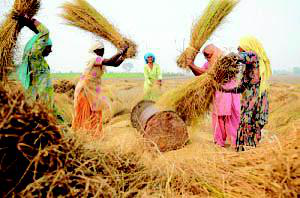
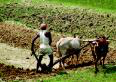

# Topic 1 — AGRICULTURE - CROPS
*(Grade 5 EVS, ts_scert_class5_environmental_studies_en, Chapter 2, Pages 25-28)*

> **REAL FULL PIPELINE OUTPUT — fresh run, 2026-09-28.** Real Gemini 2.5
> Flash, real bilingual layer, real images (using the section-aware image
> fix from today — this run attached 3 real pictures to this topic alone,
> not the 1-per-lesson the old code would have given it). Cost for all 3
> topics: **$0.0618**. **Result: needsReview.** All Telugu is an
> **unreviewed draft**. Images are saved locally in `images/` next to this
> file — the catalog only signs them for 6 hours, so a live URL would have
> gone dead by the time anyone opened this file.

Objective: Identify steps and tools in farming.

Floor: Given an empty seed packet, a child can point to it and say it is
for planting, connecting it to the first step of farming.

*Section order below is the book's own teaching order for this topic
(Refresher → Real Life → Challenge → Concept → Level Set → Explore) —
Real Life and Challenge come before Concept here because that's the
order the textbook's own pages actually teach in, not the canonical
default.*

---

## Real Life (4 min)

1. **Farmers work hard to grow our food.** Explain that the food grains,
   vegetables, and fruits we eat come from farmers' hard work.
    <small>**తెలుగు:** మనం తినే ఆహార ధాన్యాలు, కూరగాయలు, పండ్లు రైతుల
   కష్టార్జితం నుండి వస్తాయని వివరించండి. పొలంలో పనిచేస్తున్న వ్యక్తుల
   చిత్రాన్ని చూపించి, వీరే రైతులు అని చెప్పండి.</small>

   

   *Real caption: "Several people are working in a field, holding
   bundles of harvested crops and using a machine to separate the grain
   from the stalks."*

2. **Many people depend on farmers for food.** Ask students who gives
   them their food, then explain that everyone — villages or cities —
   relies on farmers.
    <small>**తెలుగు:** విద్యార్థులను వారికి ఆహారం ఎవరు ఇస్తారు అని
   అడగండి. కొన్ని ఊహల తర్వాత, గ్రామాలు లేదా నగరాల్లో ఉన్న ప్రతి ఒక్కరూ
   ఆహారం కోసం రైతులపై ఆధారపడతారని వివరించండి.</small>
3. **Different tools are used for different farm tasks.** A plough
   prepares the soil, a sickle cuts crops — like a spoon is for eating
   and a knife is for cutting.
    <small>**తెలుగు:** నాగలి నేలను సిద్ధం చేస్తుందని, కొడవలి పంటలను
   కోయడానికి సహాయపడుతుందని వివరించండి, స్పూన్ తినడానికి, కత్తి కోయడానికి
   ఉపయోగపడినట్లే.</small>

*Flagged issue: this bullet's own detail text and the catalog caption
both cite `img_c5ch2_06` by name ("point to a picture of people working
in a field (img_c5ch2_06)"), but the picture actually attached here is
`img_c5ch2_01`. Real content the model wrote does not match the real
picture the pipeline placed — a genuine citation mismatch, left exactly
as generated rather than quietly fixed, so it's visible.*

---

## Challenge — "Group discussion on impact of farmers stopping cultivation" (12 min)

- **PLAY: Discuss farmer's role and local crops.** Pairs discuss two
  textbook questions: "What happens if farmers stop cultivation?" and
  "What crops are grown in your village/city?" Five minutes.
   **తెలుగు (full):** తరగతిని జతలుగా విభజించండి. పాఠ్యపుస్తకం నుండి
  రెండు ప్రశ్నలను చర్చించమని ప్రతి జతను అడగండి: 'రైతులు సాగు ఆపేస్తే
  ఏమి జరుగుతుంది?' మరియు 'మీ గ్రామం/నగరంలో పండించే వివిధ పంటలు
  ఏమిటి?'. చర్చించి, వారి సమాధానాలను వ్రాయడానికి జతలకు 5 నిమిషాలు
  ఇవ్వండి.

  

  *Real caption: "This picture shows a crowbar, which is a tool used in
  agriculture."*

- **REFLECT: Share findings on farmers' impact.** A few pairs share one
  thing they discussed, with a brief reason.
   **తెలుగు (full):** తరగతిని తిరిగి ఒకచోట చేర్చండి. రైతులు సాగు
  ఆపేస్తే ఏమి జరుగుతుందో వారు చర్చించిన ఒక విషయాన్ని పంచుకోమని కొన్ని
  జతలను అడగండి.
- **ACT: Identify who depends on agriculture.** Everyone depends on
  farmers for food — without them, markets would have none.
   **తెలుగు (full):** వ్యవసాయంపై ఎవరు ఆధారపడతారు మరియు ఎలా
  ఆధారపడతారో గుర్తించమని జతలను అడగండి. ఆహారం కోసం ప్రతి ఒక్కరూ
  రైతులపై ఆధారపడతారని వివరించండి.

---

## Concept (7 min)

1. **Agriculture is growing crops for food.** Ask students to name
   foods they eat daily and connect them back to agriculture.
    <small>**తెలుగు:** వ్యవసాయం అంటే ధాన్యాలు, కూరగాయలు, పండ్లు వంటి
   ఆహారాన్ని పండించడం అని వివరించండి. విద్యార్థులు ప్రతిరోజూ తినే కొన్ని
   ఆహార పదార్థాల పేర్లు చెప్పమని అడిగి, అవి వ్యవసాయం నుండి వస్తాయని
   చెప్పండి.</small>

   

   *Real caption: "A farmer is using a plough pulled by two oxen to till
   a field. This image shows the traditional method of tilling land."*

2. **Farming involves a series of steps.** Not one action but many —
   soil, planting, harvest, each building on the last.
    <small>**తెలుగు:** వ్యవసాయం అనేది ఒకే పని కాదని, నేల సిద్ధం
   చేయడం నుండి ఆహారాన్ని తినడానికి సిద్ధం చేయడం వరకు అనేక దశలు
   ఉంటాయని వివరించండి.</small>
3. **Tools help farmers with each step — the if-then gap-closer.** If a
   child suggests any tool works for any job, demonstrate trying to
   "dig" with a flat hand versus a cupped hand — shape matters for the
   job.
    <small>**తెలుగు:** ఒక పిల్లవాడు ఏదైనా పనికి ఒక పనిముట్టు
   సరిపోతుందని చెబితే, చదునైన చేతితో 'తవ్వడానికి' ప్రయత్నించి, ఆపై
   గుప్పెటతో తవ్వడానికి ప్రయత్నించి, పనికి ఆకారం ఎలా ముఖ్యమో
   చూపించండి.</small>

---

## Level Set (14 min)

1. **Farming is a series of steps with tools.** Pairs name one step and
   one tool. The mustard-seed/mango-seed gap-closer, if a child thinks
   all seeds grow the same way.
    <small>**తెలుగు:** అన్ని విత్తనాలు ఒకే విధంగా పెరుగుతాయని ఒక
   పిల్లవాడు అనుకుంటే, చిన్న ఆవాల గింజకు పెద్ద మామిడి గింజకు ఒకే
   రకమైన సంరక్షణ అవసరమా అని ఆలోచించమని అడగండి.</small>
2. **Share one interesting fact learned today.** 30-second partner
   share.
    <small>**తెలుగు:** ఈ రోజు వ్యవసాయం లేదా రైతుల గురించి వారు
   చాలా ఆసక్తికరంగా లేదా సులభంగా అర్థం చేసుకున్న ఒక విషయాన్ని
   భాగస్వామితో పంచుకోమని విద్యార్థులను అడగండి.</small>
3. **Notice farm tools in the village.** On the way home — what job the
   tool does, and why its shape suits that job.
    <small>**తెలుగు:** విద్యార్థులు తమ గ్రామంలో లేదా ఇంటికి
   వెళ్ళేటప్పుడు చూసే ఏదైనా వ్యవసాయ పనిముట్ల కోసం చూడమని
   ఆహ్వానించండి.</small>

*Level Set alone is 14 of this period's 42 assigned minutes — see the
timing check at the bottom.*

---

## Explore (5 min — board sketch: people working in fields)

1. **Observe people working in fields.** Near home or on the way to
   school — what are they doing, what tools are they using.
    **తెలుగు (full):** తమ ఇళ్ల దగ్గర లేదా పాఠశాలకు వెళ్ళే దారిలో
   పొలాల్లో పనిచేస్తున్న వ్యక్తుల కోసం చూడమని విద్యార్థులకు చెప్పండి.
2. **Identify different crops growing.** Food grains, vegetables, or
   fruits?
    **తెలుగు (full):** వారు వెళ్ళే పొలాల్లో పెరుగుతున్న వివిధ రకాల
   పంటలను గుర్తించడానికి ప్రయత్నించమని విద్యార్థులకు చెప్పండి.
3. **Notice sources of water for fields.** Borewells or wells.
    **తెలుగు (full):** రైతులు తమ పంటలకు నీటిని పొందడానికి
   ఉపయోగించే బోరుబావులు లేదా బావుల కోసం చూడమని వారిని అడగండి.

Materials: empty seed packets, small stones, soil samples.

---

## Why this didn't ship

- **The `img_c5ch2_06` / `img_c5ch2_01` citation mismatch** flagged
  above under Real Life — real content, real picture, but they don't
  name each other correctly.
- **Level Set is running 14 of 42 minutes** — a third of the whole
  period on self-check and reflection, more than Concept (7) and Real
  Life (4) combined. Worth a teacher's own judgment before using the
  timings as printed.
- Pipeline's own validator returned no blocking findings this run
  (`reviewReasons: []`) — flagged `needsReview` on the strength of the
  citation mismatch alone, which the automated checks don't currently
  catch (they check whether a citation exists, not whether the id it
  names matches the id actually attached).

## Timing check

Real Life 4 + Challenge 12 + Concept 7 + Level Set 14 + Explore 5 = 42
min (no Refresher — first topic of the chapter).
