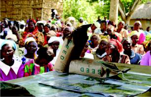
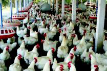

# Topic 2 — Compare different ways farmers grow crops
*(Grade 5 EVS, Chapter 2, Pages 28)*

> **REAL FULL PIPELINE OUTPUT — same run as Topic 1, 2026-09-28.**
> Refresher built from Topic 1's real Explore. **Result: shipped** — the
> only one of these 3 topics that passed every gate. All Telugu is an
> **unreviewed draft**. Images saved locally in `images/` (see Topic 1's
> note on why — the catalog's URLs expire in 6 hours).

Objective: Compare different ways farmers grow crops.

Floor: Given two different empty seed packets, a child can say that
farmers use different kinds of seeds for different crops.

*Book's own teaching order: Refresher → Challenge → Concept → Real Life
→ Level Set → Explore.*

---

## Refresher (4 min — from Topic 1's real Explore)

1. **Recall what farmers do in fields.** What action did they see a
   farmer doing, on the way home or in the village.
    <small>**తెలుగు:** విద్యార్థులు ఇంటికి వెళ్ళేటప్పుడు లేదా
   వాళ్ళ ఊళ్ళో పొలాల్లో పనిచేసే వాళ్ళని చూసింది గుర్తుచేసుకోమని
   అడగండి. రైతులు చేసే ఒక పనిని చెప్పమనండి.</small>
2. **Name crops growing in local fields.** Quick 30-second pair share.
    <small>**తెలుగు:** దగ్గర్లోని పొలాల్లో పండే పంటల పేర్లు
   చెప్పమని విద్యార్థులను అడగండి.</small>
3. **Identify water sources for farming.** Borewells or wells — water
   is essential for crops.
    <small>**తెలుగు:** వాళ్ళ ప్రాంతంలోని పొలాలకు నీరు ఎలా
   వస్తుందో వివరించమని విద్యార్థులను అడగండి.</small>

---

## Challenge — "Group discussion questions about crop yield, seed shortages" (10 min)

- **PLAY: Discuss reasons for poor yield and seed problems.** Each pair
  picks ONE of two textbook questions: "Why did Ramulu not get a good
  yield?" or "Why is there a shortage of seeds?" Five minutes.
   **తెలుగు (full):** తరగతిని జతలుగా విభజించండి. పాఠ్యపుస్తకం నుండి
  ఈ ప్రశ్నలలో ఒకదాన్ని చర్చించడానికి ప్రతి జతను ఎంచుకోమని అడగండి:
  'రాములుకు మంచి దిగుబడి రాకపోవడానికి కారణం ఏమిటి?' లేదా 'విత్తనాల
  కొరత ఎందుకు ఉంది?'.
- **REFLECT: Share chosen problem and ideas.** A few pairs share which
  question they picked and their reasoning.
   **తెలుగు (full):** తరగతిని తిరిగి ఒకచోట చేర్చండి. కొన్ని జతలను
  వారు ఏ ప్రశ్నను ఎంచుకున్నారో మరియు వారు ఏమి చర్చించారో పంచుకోమని
  అడగండి.
- **ACT: Explain how farmers got seeds in the past.** Preserved good
  seeds from their own harvest, or borrowed through *Nagulu* — like
  saving seeds from a good brinjal for next season instead of buying
  new ones.
   **తెలుగు (full):** రైతులు గతంలో తమ సొంత పంట నుండి మంచి నాణ్యత
  గల విత్తనాలను నిల్వ చేసుకునేవారని లేదా 'నాగులు' ద్వారా అప్పుగా
  తీసుకునేవారని వివరించండి.

---

## Concept (6 min)

1. **Farmers choose seeds based on needs.** Not just any seed — each
   crop has specific needs, like different clothes for different
   weather.
    <small>**తెలుగు:** రైతులు కేవలం ఏ విత్తనాన్ని పడితే ఆ
   విత్తనాన్ని తీసుకోకుండా, జాగ్రత్తగా విత్తనాలను ఎంచుకుంటారని
   వివరించండి.</small>

   

   *Real caption: "A crowd of people, many of them women, are gathered
   around a vehicle on which two bags of seeds are placed. The bags are
   labelled 'SEED'."*

2. **Some seeds grow fast, others need less water.** High Yielding
   Varieties (HYV) grow quickly but need more water and care;
   traditional seeds grow slower but are hardier.
    <small>**తెలుగు:** కొన్ని విత్తనాలు, 'High Yielding Varieties'
   (HYV) వంటివి, త్వరగా పెరిగి ఎక్కువ దిగుబడిని ఇస్తాయని, కానీ వాటికి
   ఎక్కువ నీరు, సంరక్షణ అవసరమని చర్చించండి.</small>
3. **Traditional seed sharing helped farmers — *Nagulu*.** Farmers
   borrowed seeds from neighbours and returned more after harvest,
   without depending on markets.
    <small>**తెలుగు:** గతంలో, రైతులు పొరుగువారి నుండి విత్తనాలను
   అప్పుగా తీసుకొని, పంట కోసిన తర్వాత ఎక్కువ తిరిగి ఇచ్చేవారని
   వివరించండి.</small>

---

## Real Life (8 min)

1. **Ramulu's story: good crop, poor yield.** Market seeds can be
   "substandard" and not grow well, even if the plant looks healthy.
    <small>**తెలుగు:** రాములు పత్తి విత్తనాలు కొన్న కథను చదవండి.
   అతని పంట బాగా ఉన్నా దిగుబడి ఎందుకు రాలేదని ఆలోచించమని
   విద్యార్థులను అడగండి.</small>

   

   *Real caption: "A large number of white chickens are gathered in a
   poultry farm, with feeders visible in the background." — flagged
   below: this picture does not depict what the bullet's own text is
   about.*

2. **Crowds for seeds show farmer dependence.** Many farmers now depend
   on markets for seeds rather than saving their own — a real risk if
   seed quality is poor.
    <small>**తెలుగు:** విత్తనాల కోసం క్యూలలో ఉన్న ప్రజల చిత్రాన్ని
   చూపండి. ఈ గుంపు ఇప్పుడు ఎంతమంది రైతులు తమ సొంత విత్తనాలను నిల్వ
   చేసుకోకుండా మార్కెట్లపై ఆధారపడుతున్నారో చూపిస్తుందని
   వివరించండి.</small>
3. **Local crops vary by village/city.** Soil, water, and weather decide
   what grows where — some regions known for rice, others for wheat.
    <small>**తెలుగు:** నేల, నీరు మరియు వాతావరణాన్ని బట్టి వేర్వేరు
   ప్రదేశాలలో వేర్వేరు పంటలు పండుతాయని వివరించండి.</small>

*Flagged issue: bullet 1 (Ramulu's poor-yield story) has the poultry
farm picture (`img_c5ch2_18`) attached to it — a picture with nothing
to do with cotton seeds or crop yield. The image that actually belongs
here, per the text, is the seed-queue crowd (`img_c5ch2_17`), which is
already used under Concept. A positional fallback placed the nearest
spare picture rather than the right one — a real limitation worth
knowing about, not hidden.*

---

## Level Set (12 min)

1. **Seeds are chosen for specific needs.** Not all seeds grow the same
   way — the mango-tree/rice-grain gap-closer if a child thinks
   otherwise.
    <small>**తెలుగు:** ఒక పిల్లవాడు అలా అనుకుంటే, మామిడి చెట్టు
   వరి ధాన్యం నుండి పెరుగుతుందా అని ఆలోచించమని అడగండి.</small>
2. **Identify different crops and their needs.** Two crops, one need
   each (water, sunlight, good soil).
    <small>**తెలుగు:** విద్యార్థులు ఒక భాగస్వామితో కలిసి రెండు
   వేర్వేరు పంటల పేర్లు మరియు ప్రతి పంట బాగా పెరగడానికి అవసరమైన ఒక
   విషయాన్ని చెప్పమని చెప్పండి.</small>
3. **Look for different seeds at home.** Rice, dal, mustard — size,
   shape, colour, and what plant each grows into.
    <small>**తెలుగు:** విద్యార్థులు ఇంట్లో లేదా వారి వంటగదిలో
   వేర్వేరు రకాల విత్తనాల కోసం చూడమని ఆహ్వానించండి.</small>

---

## Explore (5 min — board sketch: different crops)

1. **Observe different types of crops.** Do some look like they need
   more water than others?
    **తెలుగు (full):** పొలాల్లో లేదా మార్కెట్‌లో కనిపించే వివిధ
   రకాల పంటలను గమనించమని విద్యార్థులకు చెప్పండి.
2. **Ask about seed sources in their village.** Does the farmer save
   seeds or buy them from the market?
    **తెలుగు (full):** తమ గ్రామంలోని పెద్దవారిని లేదా రైతును వారు
   విత్తనాలను ఎక్కడ నుండి పొందుతారో అడగమని విద్యార్థులకు చెప్పండి.
3. **Notice how different crops are grown.** Straight rows, or mixed
   together in the same field?
    **తెలుగు (full):** వివిధ పంటలను ఎలా నాటుతారో గమనించమని
   విద్యార్థులకు చెప్పండి.

Materials: pictures of different crops.

---

## Why this shipped

- No blocking findings from the pipeline's own validator.
- The if-then gap-closer pattern (Concept bullet 1, Level Set bullet 1)
  is present and specific, not just a restated fact.
- Refresher genuinely picks up Topic 1's own Explore content (fields,
  crops, water sources) rather than inventing something new.

## Worth a teacher's own judgment anyway

- **The `img_c5ch2_18` poultry-farm picture attached to the Ramulu
  story** — a real mismatch, flagged above, that the automated gates
  didn't catch because nothing currently checks whether an attached
  picture's own content matches the bullet's text.

## Timing check

Refresher 4 + Challenge 10 + Concept 6 + Real Life 8 + Level Set 12 +
Explore 5 = 45 min.
