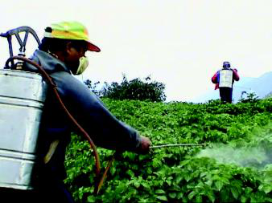
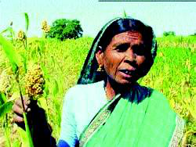

# Topic 3 — 2.5 The Success Story of a Woman Farmer
*(Grade 5 EVS, Chapter 2, Pages 30-33)*

> **REAL FULL PIPELINE OUTPUT — same run as Topics 1-2, 2026-09-28.**
> Refresher built from Topic 2's real Explore. **Result: needsReview.**
> All Telugu is an **unreviewed draft**. Images saved locally in
> `images/` (see Topic 1's note — the catalog's URLs expire in 6 hours).

Objective: Explain how traditional farming helps the earth.

Floor: Given two different soil samples, a child can say that one looks
healthier for growing plants than the other, without needing to explain
why.

*Book's own teaching order: Refresher → Real Life → Concept → Challenge
→ Level Set → Explore.*

---

## Refresher (5 min — from Topic 2's real Explore)

1. **Share observations on crop growth.** What did they notice about
   how different crops are grown, in their village or nearby fields.
    <small>**తెలుగు:** విద్యార్థులను వారి గ్రామంలో లేదా సమీప
   పొలాల్లో వివిధ పంటలను ఎలా పండిస్తున్నారో గమనించిన ఒక విషయాన్ని
   పంచుకోమని అడగండి.</small>
2. **Recall where farmers get seeds.** 30-second pair discussion, then
   share.
    <small>**తెలుగు:** రైతులు తమ విత్తనాలను ఎక్కడ నుండి
   పొందుతారో వారు ఏమి నేర్చుకున్నారో విద్యార్థులను అడగండి.</small>
3. **Discuss different crop needs.** Water or soil — examples they
   observed and what those crops needed.
    <small>**తెలుగు:** వివిధ పంటలకు నీరు లేదా నేల వంటి విభిన్న
   అవసరాలు ఎలా ఉంటాయో గుర్తుచేసుకోమని విద్యార్థులను అడగండి.</small>

---

## Real Life (8 min)

1. **Manemma's success with traditional farming.** A woman farmer who
   used bio-fertilisers and mixed cropping to make her barren land
   fertile.
    <small>**తెలుగు:** గంగావర్ మనేమ్మ అనే మహిళా రైతు కథను చెప్పండి,
   ఆమె తన బీడు భూమిని సారవంతం చేయడానికి bio-fertilisers మరియు mixed
   cropping వంటి సాంప్రదాయ పద్ధతులను ఉపయోగించింది.</small>

   

   *Real caption: "Two farmers are spraying pesticides on crops in a
   field. They are wearing protective masks and carrying tanks of
   pesticide on their backs." — flagged below: this is a chemical-
   pesticide picture attached to a bullet about Manemma's traditional,
   chemical-free methods — close to the topic, not close to this
   specific sentence.*

2. **Washing fruits removes harmful chemicals.** Vasantha's grape story
   — why we wash fruit and vegetables before eating.
    <small>**తెలుగు:** ద్రాక్ష కడగడం గురించి వసంత కథ చర్చించండి.
   పండ్లు మరియు కూరగాయలను కడగాలి ఎందుకంటే రైతులు రసాయన
   పురుగుమందులను ఉపయోగించవచ్చు.</small>
3. **Different crops grow in different regions.** Rice, jowar, cotton —
   each needs specific weather and soil.
    <small>**తెలుగు:** తెలంగాణ మ్యాప్ వైపు చూపించి, వివిధ
   జిల్లాల్లో వరి, జొన్న లేదా పత్తి వంటి వివిధ పంటలు పండుతాయని
   వివరించండి.</small>
    *Cites the Telangana crop map (`img_c5ch2_22`) by name but no
   picture is actually attached to this bullet — the pipeline's own
   picture budget for this topic ran out before reaching it.*

---

## Concept (6 min)

1. **Traditional farming uses natural methods.** Bio-fertilisers from
   cow dung and neem leaves instead of artificial chemicals — like
   homemade remedies instead of store-bought medicine.
    <small>**తెలుగు:** సాంప్రదాయ వ్యవసాయం అంటే పంటలను పండించడానికి
   సహజ పద్ధతులను ఉపయోగించడం అని వివరించండి.</small>

   

   *Real caption: "Gangawar Manemma, a woman farmer, is shown standing
   in a field of jowar plants. She is holding a stalk of jowar in her
   hand." — the one image in this whole topic that genuinely matches
   what its bullet is about.*

2. **Bio-pesticides are safer than chemical ones.** Neem oil or garlic
   keep insects away, without harming people or helpful insects.
    <small>**తెలుగు:** పంటల నుండి కీటకాలను దూరంగా ఉంచడానికి వేప
   నూనె లేదా వెల్లుల్లి వంటి వాటిని ఉపయోగించి, bio-pesticides సహజ
   మార్గాలని పరిచయం చేయండి.</small>
3. **Healthy soil grows healthy food.** Two soil samples — one dark and
   crumbly (healthy), one sandy and light (depleted).
    <small>**తెలుగు:** రెండు నేల నమూనాలతో ప్రదర్శించండి: ఒకటి
   ముదురు మరియు పొడిపొడిగా (ఆరోగ్యకరమైనది), ఒకటి ఇసుకతో కూడినది
   మరియు తేలికైనది (క్షీణించినది).</small>

---

## Challenge — "Group discussion on Manemma's good practices and the help" (10 min)

- **PLAY: Discuss Manemma's good farming practices.** Each pair picks
  ONE textbook question: "What good practices did Manemma follow?" or
  "Should we appreciate Manemma? Why?"
   **తెలుగు (full):** తరగతిని జంటలుగా విభజించండి. పాఠ్యపుస్తకం
  నుండి ఈ ప్రశ్నలలో ఒకదానిని చర్చించమని ప్రతి జంటను అడగండి: 'మనేమ్మ
  అనుసరించిన మంచి సాగు పద్ధతులు ఏమిటి?' లేదా 'మనం మనేమ్మను
  అభినందించాలా? ఎందుకు?'.
- **REFLECT: Share Manemma's practices and reasons.** A few pairs
  share which question they picked.
   **తెలుగు (full):** తరగతిని తిరిగి ఒకచోట చేర్చండి. కొన్ని
  జంటలను వారు ఏ ప్రశ్నను ఎంచుకున్నారో పంచుకోమని అడగండి.
- **ACT: Identify who helped Manemma and how.** The Deccan Development
  Society (DDS) gave her seeds and traditional-farming knowledge — like
  a teacher helping students learn something new.
   **తెలుగు (full):** Deccan Development Society (DDS) ఆమెకు
  విత్తనాలు మరియు సాంప్రదాయ వ్యవసాయం గురించి జ్ఞానాన్ని అందించడం
  ద్వారా సహాయం చేసిందని వివరించండి.

---

## Level Set (11 min)

1. **Traditional farming helps soil and yield.** More food doesn't
   always mean better food — is chemical-heavy food as good as natural
   food?
    <small>**తెలుగు:** ఎక్కువ ఆహారం ఎల్లప్పుడూ అందరికీ మంచి ఆహారం
   అవుతుందా అని చర్చించమని జంటలను అడగండి.</small>
2. **Share one benefit of traditional farming.** 30-second partner
   share, positive impacts only.
    <small>**తెలుగు:** ఈ రోజు వారికి ఆసక్తికరంగా అనిపించిన
   సాంప్రదాయ వ్యవసాయం యొక్క ఒక ప్రయోజనాన్ని పంచుకోమని చెప్పండి.</small>
3. **Find examples of natural fertilizers.** Fallen leaves, cow dung,
   ash — how might these help plants grow.
    <small>**తెలుగు:** నేల ఆరోగ్యంగా ఉండటానికి ఉపయోగపడే సహజ
   వస్తువుల కోసం చూడమని విద్యార్థులను ఆహ్వానించండి.</small>

---

## Explore (5 min — board sketch: Gangawar Manemma in a field)

1. **Notice different ways fields are managed.** One crop, or several
   different crops together (mixed cropping)?
    **తెలుగు (full):** రైతులు ఒకే రకమైన పంటను పండిస్తున్నారా లేదా
   అనేక విభిన్న పంటలను కలిపి పండిస్తున్నారా అని చూడండి.
2. **Identify natural materials used in farming.** Neem leaves, cow
   dung, compost pits.
    **తెలుగు (full):** రైతులు తమ పొలాల చుట్టూ ఉపయోగించే సహజ
   వస్తువుల కోసం చూడమని విద్యార్థులకు చెప్పండి.
3. **Ask about pesticide use in local farms.** Chemical or natural, and
   why.
    **తెలుగు (full):** పెద్దవారిని లేదా రైతును పురుగుమందులు
   ఉపయోగిస్తున్నారా అని అడగమని విద్యార్థులకు చెప్పండి.

Materials: soil samples.

---

## Why this didn't ship

- **Real pipeline finding:** "Refresher appears to be built from THIS
  topic's own pages rather than Topic 2's Explore — 4 content word(s)
  unique to this topic's textbook (crop, farmers, needs, soil) against
  0 unique to the previous Explore. A Refresher recaps a lesson the
  class actually had." — a genuine handoff-chain break, not a false
  alarm.
- **Real pipeline finding:** soil samples are asked for but not listed
  as available materials and need preparation. Fix suggested: verbal
  description or a blackboard drawing instead.
- **Image mismatch, flagged above:** the chemical-pesticide-spraying
  picture (`img_c5ch2_21`) landed on the Manemma bullet, whose whole
  point is that she used *traditional, chemical-free* methods — close
  to the topic, working against the specific sentence.

## What's genuinely good here

- The Concept image (`img_c5ch2_20`, Manemma herself in her jowar
  field) is a real, correct match — the one picture in this topic that
  actually shows what its bullet describes.
- The if-then gap-closer in Level Set ("is chemical-heavy food as good
  as natural food?") gives the misconception a genuine two-sided
  question, not a leading one.

## Timing check

Refresher 5 + Real Life 8 + Concept 6 + Challenge 10 + Level Set 11 +
Explore 5 = 45 min.
